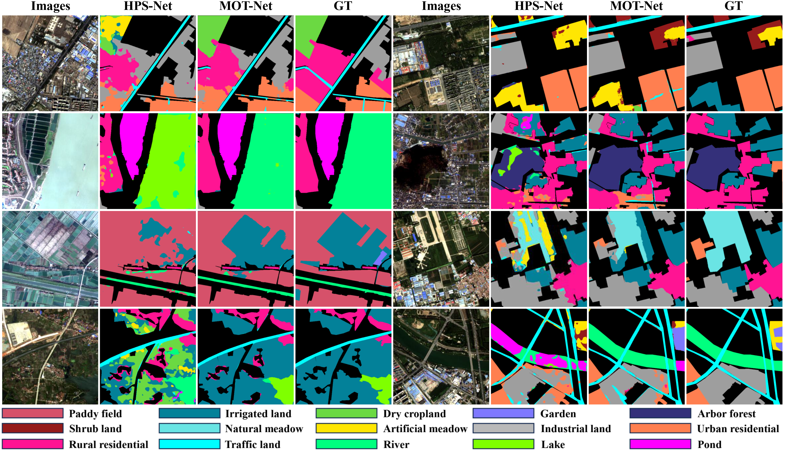

# MOT-Net
This is the official implementation of the pixel-wise path selection method MOT-Net for semantic segmentation of remote sensing images. Several examples of visual results of the MOT-Net and state-of-the-art path selection method are as follows.

  

  

  
Fig.1 Examples of visual results of the MOT-Net and state-of-the-art path selection method on GID-15.

  

 
The whole dataset and code will be available soon here in the future. 

 

